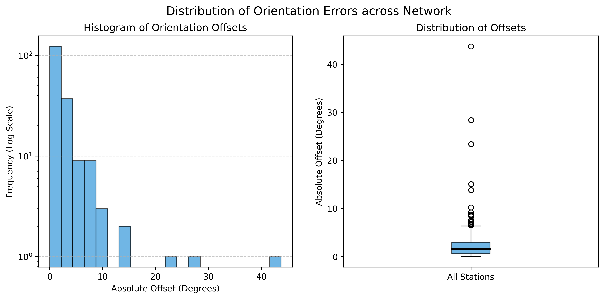
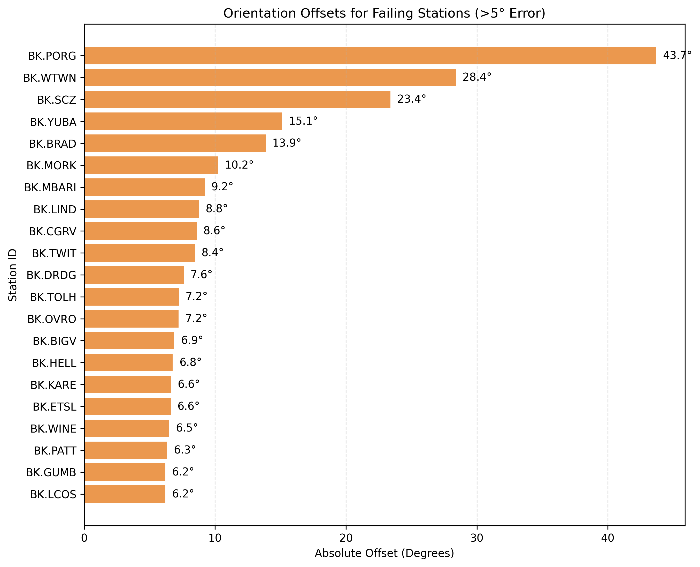

# Waveform Simulation & Sensor Orientation

A Python-based toolkit for seismometer orientation analysis using the Doran-Laske method. This repository automates the process of fetching waveform data, calculating sensor orientation from Rayleigh wave polarization, and visualizing the results.

## Overview

Accurate sensor orientation is critical for high-quality seismic analysis. This tool provides a robust pipeline to:
1. Fetch earthquake catalogs and waveform data (via ObsPy).
2. Compute path-averaged group velocities using dispersion tables.
3. Perform polarization analysis across multiple frequencies (10–40 mHz).
4. Generate statistical estimates of orientation offsets with bootstrap confidence intervals.

## Project Structure

```text
waveform-simulation/
├── src/                # Core logic and visualization scripts
│   ├── main.py         # Primary orientation calculation engine
│   └── visualizations.py # Summary plotting and error analysis
├── data/               # Configuration and reference maps
│   ├── maps/           # Global velocity maps (R.gv.*.txt)
│   └── summary.csv     # Compiled results from network runs
├── configs/            # Parameter and network configurations
│   └── dlopy.yml       # Global settings (clients, stations, time ranges)
├── outputs/            # Generated results (per-station directories)
├── assets/             # Documentation assets
│   └── images/         # Representative analysis plots
└── README.md           # Documentation
```

## Setup

```bash
# Clone the repository
git clone git@github.com:matthew-ju/waveform-simulation.git
cd waveform-simulation

# Create environment and install dependencies
conda create -n bsl python=3.11 -y
conda activate bsl
conda install -c conda-forge obspy numpy scipy matplotlib pandas pyyaml geographiclib tqdm -y
```

## Configuration

The analysis is driven by `configs/dlopy.yml`. Key parameters include:

| Key | Description | Typical Value |
| :-- | :--- | :--- |
| `multiple` | Batch run over station file vs. single station | `true` |
| `sta_file` | Path to file containing station list | `stations.txt` |
| `net`, `sta` | Default network and station codes | `BK`, `YUBA` |
| `time1`, `time2` | Analysis time window | `"2025-01-01 ..."` |
| `minmag` | Minimum earthquake magnitude for analysis | `6.5` |
| `verb` | Verbosity level (0-2) | `2` |

## How to Run

1. **Prepare Station List**: Ensure a `stations.txt` file exists in the root directory (one station code per line).
2. **Execute Analysis**:
   ```bash
   python src/main.py -c configs/dlopy.yml
   ```
3. **Generate Visualizations**:
   ```bash
   python src/visualizations.py
   ```

## Interpreting Results

### Per-Station Plots (stored in `outputs/`)
- **Orientation-Correlation**: Scatter plot showing orientation estimates vs. cross-correlation values. Solid lines indicate the mean azimuth, and dotted lines show bootstrap confidence intervals.
- **Spread of Azimuth**: Histogram showing the distribution of initial estimates.
- **Bootstrapped Mean Distribution**: bell-shaped distribution of 10,000 bootstrap resamples, representing the stability of the estimate.

### Dataset Summary (`data/summary.csv`)
The summary file contains the final results for all stations, including `Mean Azimuth`, `95% CI bounds`, and an `AbsOffset` (Absolute Offset) value.

## Visual Examples

The toolkit generates high-level summaries for network-wide health assessment.

### Error Distribution


### Failing Stations Detail


## Troubleshooting
- **Missing Maps**: Ensure `data/maps/` contains all `R.gv.*.txt` files required.
- **Data Access**: If the script fails to download waveforms, check the `wf_client` setting and your internet connection.
- **Path Errors**: The script uses relative paths from the project root. Ensure you run it from the root of the repository.

## Citation & License
This workflow adapts ideas and supporting files from [BSL TOOLKIT (DLOPy)](https://github.com/sylvster/BSL_TOOLKIT).
License: MIT
